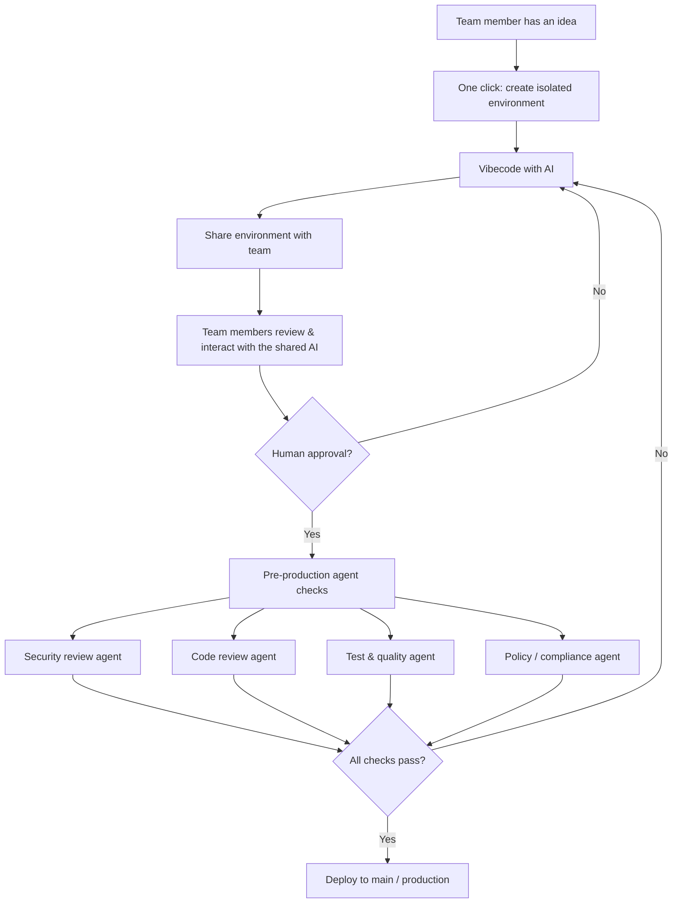

# WithVibe

[](LICENSE)
[](https://nodejs.org)
[](https://pnpm.io)
[](https://withvibe.dev)

> **Website & docs:** [withvibe.dev](https://withvibe.dev)

A shared AI environment for R&D teams. A team member spins up an isolated env
with one click, vibe-codes with AI, shares it with the team, and ships to
production once automated agent checks and human review pass.

## Flow



## The idea

- **One click to start.** No infra setup — the team member gets an isolated env seeded with the existing code.
- **Vibecode with AI.** The AI is the primary collaborator inside the env.
- **Share, don't fork.** The env is shared with the team; anyone can jump in and interact with the same AI session.
- **Automated gate before prod.** Once humans approve, specialist agents (security, code review, tests, policy) run as a final gate. Anything flagged loops back to the env.
- **Ship.** Clean pass → merge to main → production.

## Repository layout

This is a pnpm monorepo.

```
.
├── apps/
│   ├── web/        # Next.js 16 frontend + auth + REST proxy (@withvibe/web)
│   ├── api/        # NestJS backend, Docker orchestration, terminal WS (@withvibe/api)
│   └── qa-browser-extension/  # Chrome MV3 ext for the QA agent (@withvibe/qa-browser-extension)
├── packages/
│   ├── cli/        # `withvibe` CLI — install the stack and run envs locally (withvibe)
│   └── db/         # Prisma schema + generated client (@withvibe/db)
└── LICENSE         # Elastic License 2.0
```

## Prerequisites

- **Node.js** ≥ 20
- **pnpm** ≥ 9
- **PostgreSQL** ≥ 14 (local or remote)
- **Docker** + **Docker Compose** (for environment containers)
- **`gh` CLI** (recommended; used by `withvibe env` for repo cloning)

## Quick start

```bash
# 1. Install
pnpm install

# 2. Configure environment
cp apps/web/.env.example apps/web/.env
cp apps/api/.env.example apps/api/.env
# Then edit both files — see the env reference below.

# 3. Generate Prisma client and apply schema
pnpm --filter @withvibe/db generate
pnpm --filter @withvibe/db db:push

# 4. (optional) Seed initial data
pnpm --filter @withvibe/db db:seed

# 5. Run web + API in parallel
pnpm dev
```

The web app boots at <http://localhost:3000>, the API at <http://localhost:4000/api>.

### Run individual apps

```bash
pnpm dev:web     # Next.js dev server
pnpm dev:api     # NestJS in watch mode
```

### Build / verify

```bash
pnpm build       # build every workspace package
pnpm typecheck   # tsc --noEmit across the workspace
pnpm lint        # eslint (web app)
```

## Environment variables

The web app is the **frontend only** — it never touches the database. All
DB access, auth, and third-party credentials live in the NestJS API. The web
server forwards the user's session cookie to NestJS over a same-origin path.

### `apps/web/.env`

| Var | Purpose |
| --- | --- |
| `API_BASE_URL` | URL the web server uses to reach NestJS (dev only — same-origin in prod) |

### `apps/api/.env`

| Var | Purpose |
| --- | --- |
| `API_PORT` | Port the NestJS server listens on (default `4000`) |
| `DATABASE_URL` | Postgres connection string |
| `INTERNAL_JWT_SECRET` | Signs user-session JWTs (cookie) and the legacy bridge JWT |
| `REPO_BASE_DIR` | Absolute path on disk where cloned repos live |
| `API_PUBLIC_URL` | Public URL of the API — used to build the Google OAuth callback |
| `WEB_PUBLIC_URL` | Public URL of the web app — where Google OAuth lands after login |
| `ANTHROPIC_API_KEY` | Workspace-level Anthropic fallback when no per-workspace key is set |
| `GOOGLE_CLIENT_ID` / `GOOGLE_CLIENT_SECRET` | OAuth (leave empty to disable Google login) |
| `COOKIE_SECURE` | `true` to mark the session cookie `Secure` (auto in production) |
| `COOKIE_DOMAIN` | Set when API + Web are on different subdomains |

## CLI

The [`withvibe`](packages/cli) CLI lets a team member set up an environment on
their own machine — clone repos, boot Docker Compose, open VSCode.

```bash
pnpm --filter withvibe build
node packages/cli/dist/index.js login
node packages/cli/dist/index.js env <envId>
```

See [packages/cli/README.md](packages/cli/README.md) for details.

## Links

- **Website / product:** <https://withvibe.dev>
- **Documentation:** <https://withvibe.dev/docs>
- **Architecture overview:** [docs/architecture.md](docs/architecture.md)
- **Source:** <https://github.com/withvibe/withvibe>

## Contributing

See [CONTRIBUTING.md](CONTRIBUTING.md). For security issues, see
[SECURITY.md](SECURITY.md).

## License

Source code in this repository is licensed under the **Elastic License 2.0**
(ELv2). See [LICENSE](LICENSE) for the full text.

### Plain-language summary

> This summary is **not** a substitute for the [LICENSE](LICENSE) — it's just
> meant to make the common cases easy to understand.

✅ **Free to use, modify, and self-host** — including for **internal use inside
your organization** (running it for your own team, customizing it, fixing
bugs, contributing patches back).

✅ **Free to fork** and build on, as long as you keep the license notices
intact.

❌ **Not free** to offer the software (or a substantial set of its features)
to third parties as a **hosted, managed, or commercial service**.

❌ **Not free** to remove or work around any license-key functionality or
licensor notices.

### Need a different license?

If you want to use withvibe for purposes that ELv2 doesn't permit
— for example, offering it as a SaaS product, embedding it in a commercial
offering you sell to customers, or any other public/commercial distribution
beyond internal organizational use — please reach out and we'll work out a
**separate commercial license agreement**.

📧 **Commercial licensing & contact:** <https://withvibe.dev/contact>
🌐 **Website:** <https://withvibe.dev>

Copyright © 2026 WithVibe.
